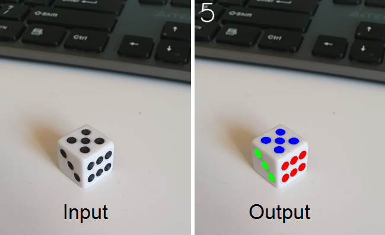

# Dice dots

This application was made as a project for 'Human-Computer Communication' classes in collaboration with [Witold Andraszyk](https://www.github.com/WAndraszyk).  

## Intorduction
The main goal of this project was to create an application that counts the number of the dots on a six-sided playing dice.  
To achieve this we created an algorithm that divides all detected dots into different sides and then reads the amount of dots on the uppermost side.  
For presentation purposes dots on each side are colored differently on the output image.

## Method

### Shape detection
The algorithm first uses the Canny method as well as binary thresholding in order to detect shapes in the input image.  
These shapes are then filtered. Since all dots of the dice (no matter the perspective) on the picture are approximately in the shape of an ellipse only ellipses should be taken into account in further actions.

It is also usefull to filter out shapes that are of too small size (since these are probably just noise).

In the program, for the purpose of filtering shapes, the simpleBlobDetector() function found in OpenCV library was used.

### Ellipse fitting
After that, the program fits each shape found to a smallest fitting rectangle, into which an ellipse is later inscribed. An alternative method to this is to use the Hough transform (though it was less time efficient - thus it was not used in the program).  
After each ellipse is made it may prove necessary to filter out all duplicate ellipses (it is possible that a single shape was detected more than once, which may have negative effect on the final results).

### Side division
Out of the fomulas of each calculated in previous step ellipses it can be approximated to which side the ellipse in question belong. This can be done through comparison of each ellipses' orientation (if the orientation angle of two ellipses is simmilar - in the app the error tolerance for such angles is 10 degrees - than it is assumed that such ellipses signify dots on the same side of the dice).  
Dots are divided onto different sides and colored on the output image in such a way that dots on each side are in a different color.

After the division, for each side of the dice an average of centroids of the dots is calculated. The side that has the highest y coordinate value is assumed to be the uppermost side, and it is this side that we count the number of dots on.

On the output image a number of counted dots is given in top-left corner.

## Example
